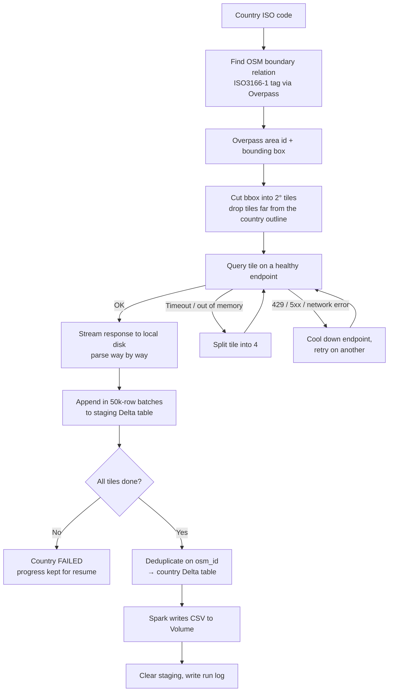

# OSM Road Extraction — one table and one CSV per country

`osm_road_extraction_per_country.py` is a Databricks notebook. It downloads OpenStreetMap roads (`highway=*` ways) edited since a given date, for every country in the world. For each country it:

1. writes a Delta table, `prd_mega.sgpbpi163.<country>_osm_road`, and
2. exports the same data as CSV to a Unity Catalog Volume.

Both happen as soon as that country finishes. Nothing builds up in driver memory, and every step is checkpointed. An interrupted run can be resumed without downloading anything twice.

---

## Contents

- [What it produces](#what-it-produces)
- [Requirements](#requirements)
- [Quick start](#quick-start)
- [Parameters](#parameters)
- [Configuration (`CFG`)](#configuration-cfg)
- [How it works](#how-it-works)
- [Output schema](#output-schema)
- [CSV files](#csv-files)
- [Resuming, refreshing and retrying](#resuming-refreshing-and-retrying)
- [Monitoring a run](#monitoring-a-run)
- [Troubleshooting](#troubleshooting)
- [Known limitations](#known-limitations)
- [Changes from the previous notebook](#changes-from-the-previous-notebook)

---

## What it produces

| Output | Location | Purpose |
|---|---|---|
| Country tables | `prd_mega.sgpbpi163.<country>_osm_road` | Final data, one Delta table per country (e.g. `bolivia_osm_road`, `democratic_republic_of_the_congo_osm_road`) |
| Country CSVs | `/Volumes/prd_mega/sgpbpi163/vgpbpi163/OSM/extraction/osm_road_csv/` | Same data as the table: `<country>_osm_road.csv`, or `_part001.csv`, `_part002.csv`, … for large countries |
| Run log | `prd_mega.sgpbpi163.osm_road_extraction_log` | One row per country attempt: status, row count, errors, CSV paths, duration |
| Tile log | `prd_mega.sgpbpi163.osm_road_tile_log` | Per-tile checkpoints used by `resume` |
| Staging | `prd_mega.sgpbpi163.osm_road_staging` | Scratch rows for countries in progress; each country's rows are removed once it is published |
| All-countries view | `prd_mega.sgpbpi163.osm_road_all` | `UNION ALL` of every published country table, used by the summary cells |

250 territories are covered: every ISO 3166-1 code in `pycountry`, plus Kosovo (`XK`).

---

## Requirements

**Databricks**
- Databricks Runtime 13.3 LTS or newer. Unity Catalog clusters, single-user or shared, and serverless all work.
- Privileges:
  - `USE CATALOG` on `prd_mega`
  - `USE SCHEMA`, `CREATE TABLE`, `MODIFY` and `SELECT` on `prd_mega.sgpbpi163`
  - `WRITE VOLUME` on `prd_mega.sgpbpi163.vgpbpi163` (only if CSV export is on)

**Network**

The cluster needs outbound HTTPS access to:
- `overpass-api.de`, `overpass.private.coffee`, `overpass.kumi.systems`, `maps.mail.ru`. These are the Overpass servers. At least one must be reachable.
- `nominatim.openstreetmap.org`. This is optional. It is only used for the outlines of large countries and as a name-based fallback.

**Python packages**

The first cell installs these; nothing else is needed:

```
pycountry>=22.3.5   ijson>=3.2   shapely>=2.0   pyproj>=3.4
```

GeoPandas and osmnx are **not** used.

---

## Quick start

1. **Import** the notebook: *Workspace → Import → File →* `osm_road_extraction_per_country.py`. It opens as a notebook with numbered sections.
2. **Test on a few countries first.** Set the `countries` widget to e.g. `LU,BO,BJ`, then *Run all*. Check the pre-flight cell (section 10). It shows which Overpass servers are reachable and whether the Volume is writable.
3. **Run the full extraction as a Job.** A full run takes many hours, and a Job survives browser disconnects and notebook timeouts.
   - *Workflows → Create job → Notebook task →* select the notebook.
   - Add the job parameters `since_date`, `countries` (empty), `mode` (`resume`) and `country_workers` (`3`).
   - Use a single-node or small cluster. The work is network-bound, not compute-bound.
4. **If the job stops or ends with failures**, run it again with `mode = resume`. Countries and tiles that already finished are skipped.

---

## Parameters

Parameters are set as widgets in the notebook or as parameters in a Job.

| Parameter | Default | Meaning |
|---|---|---|
| `since_date` | `2024-01-01T00:00:00Z` | Only ways whose last edit is on or after this UTC time are extracted. Format: `YYYY-MM-DDTHH:MM:SSZ`. |
| `countries` | *(blank)* | Comma-separated ISO2 codes, e.g. `AT,BE,BR`. Blank means all countries. |
| `mode` | `resume` | `resume` skips countries already completed for this `since_date` and continues partially done ones. `force` discards previous work for the selected countries and re-extracts them. |
| `country_workers` | `3` | Number of countries processed in parallel. |

---

## Configuration (`CFG`)

`CFG` is a dictionary in section 1. The defaults are sensible; the settings you are most likely to change are listed here.

| Key | Default | Notes |
|---|---|---|
| `catalog_schema` | `prd_mega.sgpbpi163` | Where all tables are created |
| `table_naming` | `"name"` | `"name"` gives `bolivia_osm_road`; `"iso3"` gives `bol_osm_road` |
| `create_empty_tables` | `True` | Territories with no matching roads still get an empty table and a header-only CSV |
| `csv_export` | `True` | Turn CSV export on or off |
| `csv_volume_dir` | `/Volumes/prd_mega/sgpbpi163/vgpbpi163/OSM/extraction/osm_road_csv` | CSV destination folder (created if missing) |
| `csv_max_rows_per_file` | `1_000_000` | Excel's row limit. Larger countries are split into `_partNNN` files. `None` gives one file per country. |
| `csv_compression` | `None` | `"gzip"` makes files about 5× smaller, but Excel cannot open `.gz` files directly |
| `overpass_endpoints` | 4 public servers | Order does not matter; unreachable servers are dropped at start-up |
| `slots_per_endpoint` | `1` | Concurrent requests per server. Keep this low: public servers rate-limit per IP. |
| `overpass_timeout_s` | `180` | Server-side timeout per tile query |
| `initial_tile_deg` | `2.0` | Starting tile size. Changing it invalidates the resume checkpoints for this `since_date`. |
| `max_split_depth` | `6` | A tile can be split down to about 0.03° |
| `tile_workers_per_country` | `2` | Tiles fetched in parallel within one country |
| `max_tile_attempts` | `10` | Retries per tile before the country is marked `FAILED` |
| `write_batch_rows` | `50_000` | Rows per Delta append. Lower this if driver memory is tight. |
| `final_retry_pass` | `True` | Retry failed countries once at the end, after a 300 s cool-down |
| `force_ipv4` | `True` | Avoids misleading `[Errno 101] Network is unreachable` errors from failed IPv6 attempts |

---

## How it works



**Finding the country.** Countries are identified by the `ISO3166-1` tag on their OSM boundary relation, not by name. Queries are restricted to the country's Overpass *area*, so a neighbouring country's roads inside the bounding box are excluded. If Overpass has no area for the relation, the tile falls back to a bounding-box query and a warning is logged.

**Tiling.** Tiles sit on a fixed global 2° grid, so tile ids (e.g. `g2_23_5`, split children `g2_23_5.0` … `.3`) are the same across runs. For countries spanning more than 12 tiles, tiles away from the country outline are skipped. The outline is a simplified shape from Nominatim, checked with a 0.25° margin.

**Detecting silent failures.** Overpass reports a timeout or memory error as HTTP 200 with a `remark` field. The notebook checks for that remark and for cut-off responses, so a failed tile is never recorded as "no data".

**Endpoint pool.** The four Overpass servers are health-checked at start-up. Load is spread across them with a politeness gap between requests. After a failure, a server is paused for an exponentially increasing time: 429 errors start at 60 s, other failures at 20 s, capped at 15 min. A server that turns out not to know a country's area is skipped for that tile.

**Memory.** Each response is saved to local disk, then read one way at a time with `ijson`. Rows go to Delta every 50,000 ways. Driver memory therefore stays roughly constant, whatever the size of the country.

**Publishing.** A way that crosses a tile edge is returned by every tile it touches. Publishing therefore deduplicates on `osm_id`, then overwrites the country table and exports the CSV.

---

## Output schema

Country tables and CSVs share these columns.

| Column | Type | Description |
|---|---|---|
| `osm_id` | BIGINT | OSM way id |
| `osm_version` | BIGINT | Way version |
| `osm_timestamp` | TIMESTAMP | Last edit time of the way (UTC) |
| `country_iso2`, `country_iso3`, `country_name` | STRING | Country the row was extracted for |
| `highway` | STRING | Raw `highway=` value |
| `highway_class` | STRING | Grouped class: motorway, trunk, primary, secondary, tertiary, residential, unclassified, service, pedestrian, track, path, other |
| `surface_tag` | STRING | Raw `surface=` value |
| `surface_type` | STRING | `paved` / `unpaved` / `unknown`. Taken from `surface=` if it is set, otherwise inferred from the highway type. |
| `road_name` | STRING | `name=` |
| `ref` | STRING | `ref=` (e.g. `A1`, `N7`) |
| `lanes` | INT | `lanes=` if it is numeric |
| `maxspeed_raw` | STRING | Raw `maxspeed=` value |
| `maxspeed_kmh` | DOUBLE | Speed in km/h (mph and knots converted); null for values like `walk` or `RU:urban` |
| `oneway` | STRING | `oneway=` (default `no`) |
| `bridge`, `tunnel` | BOOLEAN | True unless the tag is absent or set to `no` / `false` / `0` |
| `access` | STRING | `access=` |
| `length_m`, `length_km` | DOUBLE | Geodesic length on the WGS84 ellipsoid |
| `geometry_wkt` | STRING | `LINESTRING (lon lat, …)` in WGS84 (EPSG:4326) |
| `since_date` | STRING | The `since_date` parameter used |
| `run_id` | STRING | Run that produced the row |
| `extracted_at` | TIMESTAMP | When the row was written |

Road types extracted: motorway, trunk, primary, secondary and tertiary (each with its `_link`), residential, living_street, unclassified, service, pedestrian, busway, track, path, footway, cycleway, bridleway, road.

---

## CSV files

- UTF-8, comma-separated, with a header row. Quotes are doubled following RFC 4180, which pandas, Excel and QGIS all read correctly.
- Timestamps are written as `YYYY-MM-DDTHH:MM:SSZ` (UTC).
- Files are written by Spark directly from the Delta table, never through pandas or GeoPandas, so a large country cannot exhaust driver memory.
- Each country's CSV is written to a temporary folder first. The country's previous files are replaced only after the new export succeeds.
- To load a CSV as geometries:

  ```python
  import pandas as pd, geopandas as gpd
  df = pd.read_csv("/Volumes/prd_mega/sgpbpi163/vgpbpi163/OSM/extraction/osm_road_csv/bolivia_osm_road.csv")
  gdf = gpd.GeoDataFrame(df, geometry=gpd.GeoSeries.from_wkt(df["geometry_wkt"]), crs="EPSG:4326")
  ```

- In QGIS: *Layer → Add Delimited Text Layer → Geometry definition: WKT → field `geometry_wkt`, CRS EPSG:4326*.
- For Excel with non-Latin road names, use *Data → From Text/CSV* and choose UTF-8. Double-clicking the file may show garbled characters.

---

## Resuming, refreshing and retrying

| Situation | What to do |
|---|---|
| Job was cancelled, cluster died, some countries `FAILED` | Re-run with `mode = resume`. Completed countries are skipped. Partially done countries only fetch their missing tiles. |
| Refresh specific countries | `countries = BR,IN`, `mode = force` |
| New cut-off date | Change `since_date`. Resume state is tracked per `since_date`, so every country runs again and its table and CSV are overwritten. |
| Tables exist but CSVs are missing (e.g. CSV export was off) | Run with `mode = resume`. Missing CSVs are exported from the existing tables before extraction starts. |
| Recreate everything | Leave `countries` blank and set `mode = force` |

At the end of each run, countries that failed are retried once more (`final_retry_pass`). Countries that still fail keep all their finished tiles for the next `resume`.

---

## Monitoring a run

The notebook prints one line per finished country (✅ success, ⚪ empty, ❌ failed, ❓ unresolved), plus progress for large countries every 2 minutes. You can also query the logs while a run is going.

Latest status per country:

```sql
SELECT * FROM (
  SELECT *, ROW_NUMBER() OVER (PARTITION BY country_iso2 ORDER BY finished_at DESC) AS rn
  FROM prd_mega.sgpbpi163.osm_road_extraction_log
  WHERE since_date = '2024-01-01T00:00:00Z')
WHERE rn = 1
ORDER BY status, country_iso2;
```

Tile progress for a country still running:

```sql
SELECT status, COUNT(*) AS tiles, SUM(row_count) AS rows
FROM prd_mega.sgpbpi163.osm_road_tile_log
WHERE country_iso2 = 'BR'
GROUP BY status;
```

**Country statuses**

| Status | Meaning |
|---|---|
| `SUCCESS` | Table and CSV published |
| `EMPTY` | Country found, but no matching roads edited since `since_date`. An empty table and a header-only CSV are created. |
| `FAILED` | At least one tile, the boundary lookup, or the CSV export failed. The `error` and `failed_tiles` columns say why. Progress is kept. |
| `UNRESOLVED` | OSM has no boundary relation for this ISO code (e.g. some uninhabited territories) |

---

## Troubleshooting

| Symptom | Cause / fix |
|---|---|
| `No Overpass endpoint is reachable from this cluster` | The cluster has no outbound internet access, or a firewall is blocking it. Ask the platform team to allow the hosts listed under [Requirements](#requirements). |
| `Cannot write to /Volumes/...` | The Volume does not exist, or you lack `WRITE VOLUME` on it |
| Many countries `FAILED` with `rate_limited` or `HTTP 429` | Public servers are busy or you are over their per-IP limit. Wait and `resume`. Lower `country_workers` or `tile_workers_per_country`. |
| `no healthy Overpass endpoint for 1800s` | All servers were paused at once. This is usually temporary; `resume` later. |
| A tile fails repeatedly with `too_big` at maximum depth | Extremely dense area. Raise `overpass_timeout_s` (e.g. 300) and `resume`. |
| Driver memory still high | Lower `write_batch_rows` (e.g. 20,000) and/or `country_workers` |
| `Table name collision(s)` at start-up | Two countries map to the same name. Set `table_naming = "iso3"`. |
| `DELTA_CONCURRENT…` messages in the log | Harmless: concurrent Delta commits are retried automatically |

---

## Known limitations

- **Border roads appear in both countries.** A way crossing a border is inside both countries' areas. Deduplicate on `osm_id` when combining countries, e.g. in the `osm_road_all` view.
- **Overlapping territories.** Some OSM country boundaries contain other ISO territories. For example, France (`FR`) includes its overseas departments (`GF`, `RE`, `GP`, `MQ`, `YT`), so their roads appear in both tables.
- **What "edited since" means.** The `newer:` filter uses the way's own timestamp. It changes when the way's tags or node list change, but **not** when one of its nodes is moved. A road whose geometry was only adjusted by moving nodes is therefore not included. Ways deleted after `since_date` are not listed at all.
- **Snapshot time.** Each tile's data reflects the Overpass database at the moment it was queried; the time is saved in `osm_road_tile_log.osm_base`. Tiles in one country may be minutes to hours apart.
- **Tile skipping near coasts.** Very small, remote islands more than about 28 km (0.25°) from the simplified outline of a large country could be skipped by tile pruning.
- **Antarctica (`AQ`).** If no boundary relation is found, a hard-coded bounding box is used without an area filter, so this can take a while.
- **Runtime.** A full run covering all countries since 2024 takes many hours, mostly waiting on the public Overpass servers. Please respect their [usage policy](https://wiki.openstreetmap.org/wiki/Overpass_API#Public_Overpass_API_instances) and keep the default concurrency.

---

## Changes from the previous notebook

| Previous | Now |
|---|---|
| All GeoDataFrames kept in `all_gdfs`, which caused OOM (exit 137) | Streamed to disk, parsed incrementally, written in batches; one table and CSV per country |
| Whole-country queries with a 120 s timeout | 2° tiles that split automatically when too heavy |
| Timeout `remark` ignored, so failures showed as "no data" | Remarks and truncation detected; failures are logged, never reported as empty |
| Countries looked up by name via Nominatim (failed for BO, BQ, CD, …) | Looked up by ISO code; queried by OSM area |
| Mirror list defined but never used | Health-checked endpoint pool with fail-over and cool-downs |
| `osm_timestamp` always null (`out body`) | Populated (`out meta`) |
| Lengths in EPSG:3857, inflated by 1/cos(latitude) | Geodesic lengths on WGS84 |
| Excel export (`spark_df.to_excel` does not exist; 1M-row cap) | CSV export to a UC Volume, split at 1M rows per file |
| A crash lost all progress | Per-tile and per-country checkpoints with `resume` |

---

*Data © OpenStreetMap contributors, available under the [Open Database License (ODbL)](https://www.openstreetmap.org/copyright). Outputs derived from OSM must carry this attribution.*